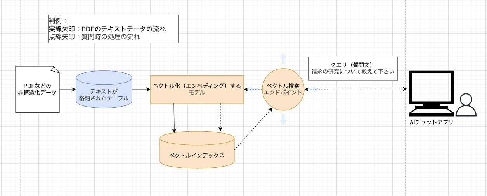

%md

## 開発のゴール

- PDFなどの非構造化テキストを下に「自然文で質問に答えられるRAGチャットボットアプリ」をデプロイする
- ただデプロイするだけでなく、
	- 一定の回答品質を担保・見える化する
	- 本番運用方法の確立

## アーキテクチャズ

## 実装工程

1. PDFからテキスト抽出（Deltaテーブルに格納）
2. テキストをベクトル化（ベクトル検索インデックスを作成）
3. ベクトルから回答を生成するRAGを実装
	1. デバッグしやすい機能を活用：Tracing・Auto-tracing
4. LLMアプリを評価（GenAI Evaluation）
5. モデルのロギングとUnity Catalogへの登録 ← 実装できたのはここまで
6. プロンプトレジストリの連携
7. 本番環境モニタリング

## 参考

- [Qiita| Databricks Free Editionで始めるMLflow @taka_yayoi in データブリックス・ジャパン](https://qiita.com/taka_yayoi/items/b28bf5bf356ce58747ef)
- [Qiita| MLflow3とDatabricksで実現するLLMops @taka_yayoi in データブリックス・ジャパン](https://qiita.com/taka_yayoi/items/2fd4c9fef0ffe8377f48)
- [Qiita| DatabricksにおけるRAGの実践(前編) @taka_yayoi in データブリックス・ジャパン](https://qiita.com/taka_yayoi/items/f174599e4721e51e9e1d)
